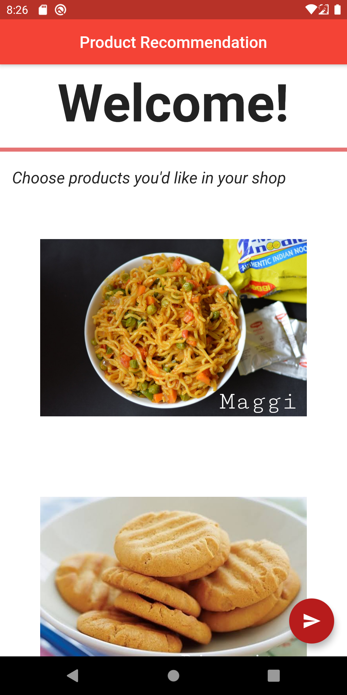
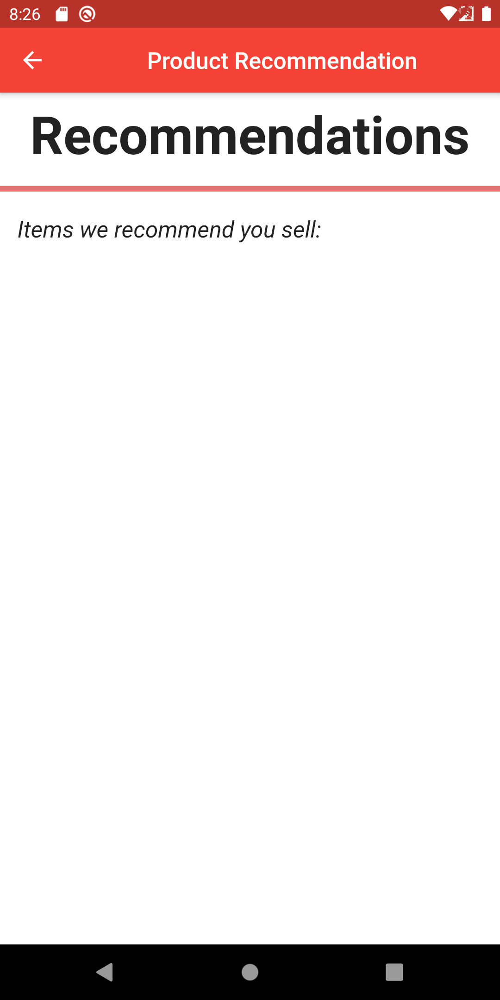

# Knowledge Management - Product Recommendation App

Knowlegde Management - UE17CS342

**Project Team:**
- Karthik N - PES1201700692
- Arushi Bohra - PES1201700703
- Nahusha A - PES1201700044
- Kevin Arulraj - PES1201700659

## Overview
A Flutter application to help local businesses and kirana owners build a recommendation system that helps maximize profits. Enables them to compare their product in hindsight with what their competitors have and helps in smarter & more statistical decision making,

## Screenshots

